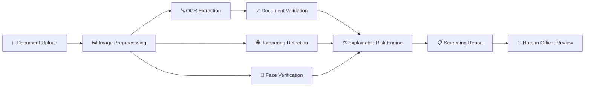

<div align="center">

# 🛂 VERIDEX

### AI-Based Fake Identity & Document Screening System

**Faster, smarter, and explainable document screening for border checkpoints.**

OCR · Document Validation · Tampering Detection · Face Verification · Explainable Risk Scoring


**Project Expo · Problem Statement ID 26188**

</div>

---

## 📌 Overview

**VERIDEX** is an AI-assisted identity and document screening platform designed for high-volume border and checkpoint environments.

The system combines **OCR, document validation, image-forensics-based tampering detection, face verification, and explainable risk scoring** into a single screening pipeline.

Instead of producing an unexplained *"Fake"* or *"Genuine"* label, VERIDEX presents the officer with the underlying evidence — what was extracted, which checks passed or failed, what anomalies were detected, and why a document may require further review.

> **VERIDEX is designed as a decision-support system, not an autonomous decision-maker.**

---

## 🚨 The Problem

Identity verification at border checkpoints can involve large numbers of passports, visas, IDs, permits, and other travel documents.

Manual inspection can become difficult when officers have to simultaneously evaluate:

* Document authenticity
* Printed information
* Machine-readable zones
* Dates and validity
* Photograph consistency
* Possible document manipulation
* Identity of the person presenting the document

### Common risks

| Challenge                     | Potential consequence                                        |
| ----------------------------- | ------------------------------------------------------------ |
| Fake passports or visas       | Forged documents may pass a quick visual inspection          |
| Altered photographs           | Identity impersonation can become difficult to detect        |
| Modified personal information | Incorrect identity data may go unnoticed                     |
| Tampered stamps               | Forged or edited stamps can appear legitimate                |
| Expired documents             | Invalid documents may be overlooked under time pressure      |
| High passenger volume         | Faster processing can increase the chance of human error     |
| Fragmented checks             | Evidence is spread across multiple manual verification steps |

The challenge is therefore not simply **detecting fake documents**.

It is making document screening **faster, consistent, explainable, and easier to investigate.**

---

# 💡 The VERIDEX Approach

VERIDEX brings multiple verification signals together into one pipeline.

### 🔍 Extract

Read important document information using OCR.

### ✅ Validate

Check fields, dates, MRZ structure, checksums, and consistency.

### 🕵️ Detect

Analyse the document image for potential signs of manipulation.

### 👤 Verify

Compare the document identity with the presented face.

### ⚖️ Explain

Combine the signals into an interpretable risk assessment.

### 📋 Report

Present the results in a structured screening report for human review.

---

## 🧭 How It Works



### Pipeline

**1. Upload**

An officer uploads an identity or travel document.

**2. Preprocessing**

The image is prepared for downstream OCR and forensic analysis.

**3. OCR Extraction**

Important fields are extracted automatically along with OCR confidence information.

**4. Document Validation**

Extracted information is checked using formatting rules, date logic, MRZ parsing, checksums, and cross-field consistency.

**5. Tampering Detection**

Image-forensics techniques look for suspicious inconsistencies that may indicate manipulation.

**6. Face Verification**

The document photograph can be compared with the presented individual.

**7. Risk Scoring**

Signals from the different modules are combined into an explainable risk assessment.

**8. Screening Report**

The officer receives the result together with the evidence behind it.

---

# 🧩 Core Modules

## 1️⃣ OCR Extraction

VERIDEX uses **PaddleOCR** to extract information from identity documents.

### Extracted information can include:

* Name
* Passport/document number
* Date of birth
* Date of issue
* Date of expiry
* MRZ information where applicable

Each extraction can retain a **confidence score**, allowing uncertain OCR results to be identified rather than silently treated as reliable.

### Why it matters

Instead of manually typing document information, the system converts the document image into structured data that downstream validation modules can process.

---

## 2️⃣ Document Validation

OCR output is not automatically trusted.

VERIDEX performs additional validation to determine whether the extracted information is internally consistent.

### Validation includes:

**Field validation**

* Required fields present
* Expected formats
* Character and length checks

**Date validation**

* Expiry status
* Impossible dates
* Invalid chronological relationships

**MRZ validation**

* MRZ parsing
* Check-digit verification
* Structural validation

**Cross-field validation**

* Printed information vs MRZ
* Passport/document number consistency
* Date consistency

This creates an important distinction:

> **OCR answers "What does the document appear to say?"**
> **Validation asks "Does that information make sense?"**

---

# 🕵️ 3️⃣ Tampering Detection

Document manipulation is treated as a separate forensic problem.

VERIDEX uses **classical image-forensics heuristics** to identify suspicious visual or metadata inconsistencies.

| Potential manipulation | Analysis focus                                 |
| ---------------------- | ---------------------------------------------- |
| Photo replacement      | Inconsistencies around the photograph region   |
| Text manipulation      | Local image irregularities around edited areas |
| Stamp forgery          | Suspicious patterns in stamp regions           |
| Image editing          | Compression/noise inconsistencies              |
| Metadata manipulation  | Suspicious or unexpected file metadata         |

### Why classical techniques?

For a prototype operating in a domain where labelled forgery datasets can be limited, interpretable image-forensics techniques provide a lightweight approach that can be inspected and explained.

The output is therefore treated as a **risk signal**, not definitive proof of forgery.

---

# 👤 4️⃣ Face Verification

A document can be genuine while the person presenting it is not the legitimate owner.

VERIDEX therefore includes a face-verification component designed to compare:

**Document photograph ↔ Presented individual**

This adds an identity-level verification layer on top of document-level validation.

The development and testing workflow uses **consented and/or synthetic data** rather than real travellers' identity information.

---

# ⚖️ Explainable Risk Scoring

One of VERIDEX's key design principles is:

> **Don't just output a score. Show why the score exists.**

Signals from the different modules are combined into an overall screening assessment.

For example:

```text
OCR
 ├── Field confidence
 └── Extraction anomalies

Validation
 ├── MRZ checksum
 ├── Date logic
 └── Visual ↔ MRZ consistency

Tampering
 ├── Image anomalies
 ├── Photo-region analysis
 └── Metadata signals

Face Verification
 └── Identity match signal
             ↓
      Explainable Risk Engine
             ↓
       Screening Report
```

### Example report

```json
{
  "document_type": "passport",

  "extracted_fields": {
    "name": "…",
    "passport_number": "…",
    "date_of_birth": "…",
    "date_of_expiry": "…"
  },

  "validation": {
    "mrz_checksums": "pass",
    "visual_vs_mrz_consistency": "flag",
    "date_logic": "pass"
  },

  "tampering": {
    "flags": ["…"]
  },

  "face_verification": {
    "match": true
  },

  "risk": {
    "score": 0.0,
    "reasons": [
      "Visual and MRZ information require review"
    ],
    "recommendation": "manual review"
  }
}
```

The exact values above are **illustrative only**.

---

# 🛡️ Responsible AI

Identity screening can directly affect people's lives, so VERIDEX is designed around several safeguards.

### 👮 Human-in-the-loop

The system provides decision support. The final decision remains with the authorised human officer.

### 🔍 Explainability

Risk signals are accompanied by the checks and observations that generated them.

### 🔐 Privacy-conscious development

Face-verification development and testing uses consented and/or synthetic data.

### ⚠️ No automatic "guilty" verdict

A suspicious signal does not automatically mean that a document is fraudulent.

### 📊 Honest evaluation

The system explicitly acknowledges limitations instead of presenting prototype results as production-grade border-security accuracy.

---

# 🛠️ Technology Stack

| Layer                   | Technology                                    |
| ----------------------- | --------------------------------------------- |
| **Frontend**            | React, Vite                                   |
| **Backend**             | Python, FastAPI                               |
| **OCR**                 | PaddleOCR                                     |
| **Document Validation** | MRZ parsing, checksums, date and format rules |
| **Image Analysis**      | Classical image-forensics heuristics          |
| **Face Verification**   | Face verification pipeline                    |
| **API Architecture**    | REST                                          |
| **Development**         | Git, GitHub                                   |
| **Testing**             | Automated testing / module-level validation   |

---

# 📁 Project Structure

```text
VERIDEX/
│
├── backend/
│   ├── OCR/
│   ├── validation/
│   ├── tampering/
│   ├── face/
│   └── risk/
│
├── frontend/
│   ├── src/
│   ├── public/
│   └── package.json
│
├── models/
│
├── datasets/
│
├── scripts/
│
├── tests/
│
├── docs/
│
├── uploads/
│
├── PROJECT_STATUS.md
├── LICENSE
└── README.md
```

> Directory names may evolve as the implementation develops.

---

# 🚀 Getting Started

## Prerequisites

* Python 3.9+
* Node.js 18+
* npm
* Git

---

## 1. Clone the repository

```bash
git clone https://github.com/sengarom/AI-Document-Screening.git
cd AI-Document-Screening
```

---

## 2. Start the backend

```bash
cd backend

python -m venv venv
source venv/bin/activate
```

Install dependencies:

```bash
pip install -r requirements.txt
```

Start FastAPI:

```bash
uvicorn main:app --reload
```

Backend:

```text
http://localhost:8000
```

Swagger API documentation:

```text
http://localhost:8000/docs
```

---

## 3. Start the frontend

Open another terminal:

```bash
cd frontend
npm install
npm run dev
```

Vite will provide the local development URL in the terminal.

---

# 🔌 API Architecture

VERIDEX follows a modular API architecture so that individual verification stages can be developed and tested independently.

| Capability         | Purpose                                 |
| ------------------ | --------------------------------------- |
| Health Check       | Verify backend availability             |
| Document Upload    | Receive document images                 |
| OCR                | Extract structured document information |
| Validation         | Verify document fields and MRZ data     |
| Tampering Analysis | Identify potential manipulation signals |
| Face Verification  | Compare identity images                 |
| Risk Assessment    | Combine verification signals            |
| Screening Report   | Return structured results               |

The FastAPI Swagger interface can be used to inspect and test the available endpoints during development.

---

# 📊 Project Status

### ✅ Implemented

* [x] FastAPI backend foundation
* [x] React + Vite frontend
* [x] Document upload workflow
* [x] Image preprocessing
* [x] PaddleOCR integration
* [x] Field extraction
* [x] OCR confidence handling
* [x] Document format validation
* [x] Date validation
* [x] MRZ parsing
* [x] MRZ checksum verification
* [x] Visual vs MRZ consistency checks
* [x] Tampering detection heuristics
* [x] Face verification workflow
* [x] Explainable risk assessment
* [x] Screening report concept

### 🚧 In Progress

* [ ] Complete React dashboard
* [ ] Expanded automated test suite
* [ ] Deployment documentation
* [ ] Additional document types
* [ ] UI refinement and accessibility improvements

### 🔮 Future Scope

* [ ] Passport, visa, national-ID and permit support
* [ ] Secure database integration
* [ ] Watchlist/blacklist integration
* [ ] Batch document processing
* [ ] High-throughput deployment
* [ ] Larger real-world evaluation datasets
* [ ] Advanced forgery-detection models
* [ ] Additional identity-verification capabilities

---

# ⚠️ Known Limitations

VERIDEX is a **project-expo prototype**, not a certified border-control system.

Important limitations include:

* OCR performance depends on image quality and document layout.
* Image-forensics heuristics can produce false positives.
* Sophisticated forgeries may evade heuristic detection.
* Face verification performance depends on image quality and evaluation data.
* Prototype results should not be interpreted as production-level security guarantees.
* Real-world deployment would require extensive validation, security review, privacy safeguards, regulatory compliance, and appropriately representative datasets.

---

# 👩🏻‍💻 Project Contributor

<div align="center">

### **Shreya Mishra**

**Visual Design · Product Presentation · Documentation**

I worked on translating a technically complex identity-screening system into a clear and accessible product experience — from the project's visual identity and diagrams to its documentation and presentation narrative.

My focus is on making the system understandable **not only to developers, but also to judges, officers, and non-technical users**.

</div>

---

# 🎯 Why VERIDEX?

Traditional verification can involve multiple disconnected checks.

VERIDEX brings them together into a single pipeline:

```text
DOCUMENT
    ↓
OCR
    ↓
VALIDATION
    ↓
TAMPERING ANALYSIS
    ↓
FACE VERIFICATION
    ↓
RISK ASSESSMENT
    ↓
EXPLAINABLE SCREENING REPORT
```

The goal isn't to replace human judgement.

It is to give the human decision-maker **more structured evidence, faster.**

---

## 📄 License

This project is distributed under the **MIT License**.

See [`LICENSE`](LICENSE) for details.

---

<div align="center">

### 🛂 VERIDEX

**AI-assisted identity and document screening**

*Extract · Validate · Detect · Verify · Explain*

**Built for Project Expo · Problem Statement 26188**

</div>
